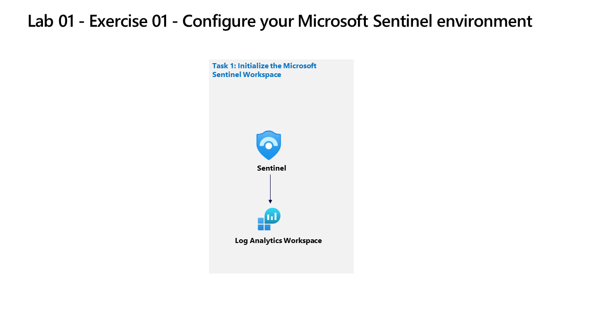

---
lab:
    title: 'Exercise 01: Create and configure a Microsoft Sentinel workspace'
    module: 'Guided Project - Deploy Microsoft Sentinel'
---

>**Note**: To complete this lab, you will need an [Azure subscription.](https://azure.microsoft.com/en-us/free/?azure-portal=true) in which you have administrative access.

## General guidelines

- When creating objects, use the default settings unless there are requirements that require different configurations.
- Only create, delete, or modify objects to achieve the stated requirements. Unnecessary changes to the environment may adversely affect your final score.
- If there are multiple approaches to achieving a goal, always choose the approach the requires the least amount of administrative effort.

We are currently evaluating the existing security posture or our corporate environment. We need your help in setting up a security information and event management (SIEM) solution to help identify future and ongoing cyber-attacks.

## Architecture diagram

## Skilling tasks

You need to deploy a Microsoft Sentinel workspace. The solution must meet the following requirements:

- Ensure Sentinel data is stored in the West US Azure region.
- Ensure that all Sentinel analytics logs are retained for 180 days.
- Assign roles to Operator1 to ensure that Operator1 can manage incidents and run sentinel playbooks. The solution must meet the principle of least privilege.

## Exercise instructions

### Task 1 - Create a Log Analytics workspace

Create a Log Analytics workspace, including region option. Learn more about [onboarding Microsoft Sentinel](https://learn.microsoft.com/azure/sentinel/quickstart-onboard).

  1. In the Azure portal, search for and select `Microsoft Sentinel`.
  1. Select **+ Create**.
  1. Select **Create a new workspace**.
  1. Select `RG2` as the Resource Group
  1. Enter a valid name for the Log Analytics workspace
  1. Select `West US` as the region for the workspace.
  1. Select **Review + create** to validate the new workspace.
  1. Select **Create** to deploy the workspace.

### Task 2 - Deploy Microsoft Sentinel to a workspace

Deploy Microsoft Sentinel to the workspace.

  1. Go to **Microsoft Sentinel**.
  1. Select the workspace you want to add Sentinel to (created in Task 1 step 5).
  1. Select **Add**.

### Task 3 - Assign a Microsoft Sentinel role to a user

Assign a Microsoft Sentinel role to a use. Learn more about [Roles and permissions for working in Microsoft Sentinel](https://learn.microsoft.com/azure/sentinel/roles)

  1. Go to the Resource group RG2
  1. Select **Access control (IAM)**.
  1. Select **Add** and `Add role assignment`.
  1. In the search bar, search for and select the `Microsoft Sentinel Contributor` role.
  1. Select **Next**.
  1. Select the option `User, group, or service principal`.
  1. Select **+ Select members**.
  1. Search for the `Operator1` assigned in your lab instructions `(operator1-XXXXXXXXX@LODSPRODMCA.onmicrosoft.com)`.
  1. Select the `user icon`.
  1. Select **Select**.
  1. Select “Review + assign”.
  1. Select “Review + assign”.

### Task 4 - Configure data retention

Configure data retention [Learn more about data retention](https://learn.microsoft.com/azure/azure-monitor/logs/data-retention-archive).

  1. Go to the `Log Analytics workspace` created in Task 1 step 5.
  1. Select **Usage and estimated costs**.
  1. Select **Data retention**.
  1. Change data retention period to **180 days**.
  1. Select **OK**.

>**Note**: For additional practice complete the [Create and manage Microsoft Sentinel workspaces](https://learn.microsoft.com/training/modules/create-manage-azure-sentinel-workspaces/) module.
