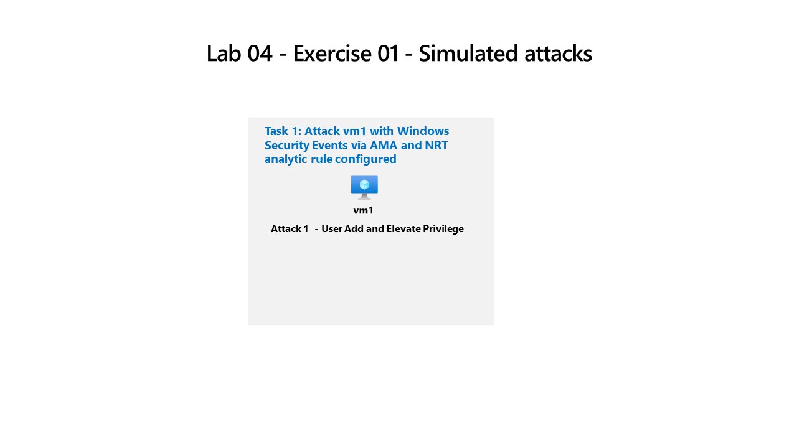

---
lab:
    title: 'Exercise 04: Perform simulated attack'
    module: 'Guided Project - Perform a simulated attack to validate Analytic and Automation rules'
---

## General guidelines

- When creating objects, use the default settings unless there are requirements that require different configurations.
- Only create, delete, or modify objects to achieve the stated requirements. Unnecessary changes to the environment may adversely affect your final score.
- If there are multiple approaches to achieving a goal, always choose the approach the requires the least amount of administrative effort.

We need to validate that Microsoft Sentinel deployment is receiving security events and creating incidents from virtual machines that run Windows.

## Architecture diagram



## Skilling tasks

You need to perform a simulated attack to validate that the Analytic and Automation rules create an incident and assign it to the `Operator1`. You will perform a simple `Privilege Escalation` attack on `vm1`.

## Exercise instructions

### Task 1 - Perform a simulated Privilege Escalation attack

Use simulated attacks to test analytic rules in Microsoft Sentinel. Learn more about [privilege escalation attack simulation](https://github.com/redcanaryco/atomic-red-team/blob/master/atomics/T1078.003/T1078.003.md).

1. Locate and select the **vm1** virtual machine in Azure and scroll down the menu items to **Operations** and select **Run command**
1. On the **Run command** pane, select **RunPowerShellScript**
1. Copy the commands below to simulate the creation of an Admin account into the `PowerShell Script` form and select **Run**

    ```CommandPrompt
    net user theusernametoadd /add
    net user theusernametoadd ThePassword1!
    net localgroup administrators theusernametoadd /add
    ```

>**Note**: Make sure there is only one command per line, and you can rerun the commands by changing the username.

1. In the `Output` window you should see `The command completed successfully` three times

### Task 2 - Verify an incident is created from the simulated attack

1. In `Microsoft Sentinel`, go to the `Threat management` menu section and select **Incidents**
1. You should see an incident that matches the `Severity` and `Title` you configured in the `NRT` rule you created
1. Select the `Incident` and the `detail` pane opens
1. The `Owner` assignment should be **Operator1**, created from the `Automation rule`, and the `Tactics and techniques` should be **Privilege Escalation** (from the `NRT` rule)
1. Select **View full details** to see all the `Incident management` capabilities and `Incident actions`
